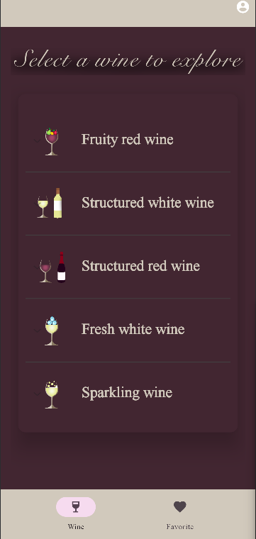
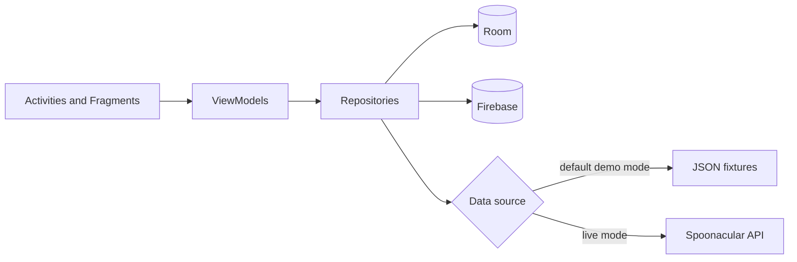

# Wine&Dine

An Android app that helps people explore wines, save favourites, and discover food pairings and recipes.

[](https://github.com/FilippoDonghi/WineDine/actions/workflows/android.yml)


> **Project context:** Wine&Dine was built by a four-person team for the Mobile Programming course at the University of Milano-Bicocca. This repository preserves the shared history and credits every contributor; it is not presented as a solo project.

<p align="center">
  
  
  
</p>

## What it demonstrates

- Repository and ViewModel separation for Android UI state.
- Retrofit/Gson integration with the Spoonacular wine and recipe API.
- Firebase Authentication, Realtime Database, and Firestore integration.
- Room persistence for recommendations and favourites.
- A fixture-backed demo path that builds and exercises the recommendation flow without a Spoonacular key.
- JVM unit tests, Android lint, and a reproducible CI build.

## Architecture



The app uses callback-based data sources behind repositories. At build time, `DEMO_MODE` selects deterministic JSON fixtures or the live Spoonacular implementation. Firebase remains responsible for authentication and, in live mode, the cloud-backed wine catalogue.

## Quick start

### Prerequisites

- JDK 17
- Android SDK 35
- Android Studio or an Android emulator/device running API 24+

From a fresh clone:

```bash
git clone https://github.com/FilippoDonghi/WineDine.git
cd WineDine
./gradlew testDebugUnitTest lintDebug assembleDebug
```

The APK is generated at `app/build/outputs/apk/debug/app-debug.apk`. You can also open the repository in Android Studio and run the `app` configuration.

No Spoonacular credential is required for the default build. When no key is supplied, Gradle enables demo mode and the wine, pairing, recipe, and dish data sources read the sample responses under `app/src/main/assets/`.

### Live Spoonacular data

To opt into live API calls, provide the key at build time and disable demo mode:

```bash
export SPOONACULAR_API_KEY="your-key"
./gradlew installDebug -PDEMO_MODE=false
```

Never commit the key. A key embedded in an Android APK can still be extracted, so a production deployment should proxy Spoonacular through a backend rather than ship a long-lived secret in the client.

## Configuration

| Setting | Default | Purpose |
|---|---:|---|
| `DEMO_MODE` | `true` when no API key is present | Select fixture-backed or live Spoonacular sources |
| `SPOONACULAR_API_KEY` | empty | Credential used only by live Spoonacular requests |
| `app/google-services.json` | team development project | Firebase client configuration for auth and cloud data |

Firebase's Android configuration is client metadata rather than a server credential, but its API key should still be restricted by package, signing certificate, and enabled APIs. Google One Tap may require a locally registered signing SHA; email/password authentication is the more portable development path.

## Verification

The CI workflow runs the same checks expected locally:

```bash
./gradlew testDebugUnitTest lintDebug assembleDebug
```

The unit suite covers repository success/failure mapping, authentication retries, duplicate in-flight request suppression, cancellation behaviour, fixture consistency, and bottle identity semantics. Automated UI coverage is not yet included. An earlier fixture navigation build was smoke-tested manually on an API 35 emulator; repeat the signed-in flow on your Firebase setup before release.

## Team and contribution

Original application contributors:

- Filippo Donghi
- Nadim El Hanafi
- Alice Faseli
- Valentina Fuso

Filippo's commits in the shared history cover dish/recipe models and pairing experiments, dynamic rating and bottle-detail UI, the profile menu, and related interface refinements. The later portfolio-maintenance work adds secret-safe configuration, fixture-backed data sources, tests, CI, and reproducible documentation. The original architecture, Firebase integration, and product are team work.

## Known limitations

- The Firebase backend belongs to the original course project and is not offered with a production availability guarantee.
- Demo mode presents the supported Merlot fixtures and one matching recipe detail. Firebase authentication is still required; live mode retrieves the full Firestore catalogue.
- The UI predates the current Compose-based Android stack and still contains legacy callback and XML-layout code.
- The repository has no open-source licence. Please contact the contributors before copying or redistributing the source or bundled assets.

The original Italian-language project report and presentation are retained under [`documentazione/`](documentazione/) for academic context.

## Security note

An older revision committed and logged a Spoonacular key. The value has been removed from the current source, but deletion in a later commit does not remove it from Git history. That credential must be revoked and replaced; history rewriting alone is not a substitute for rotation.
